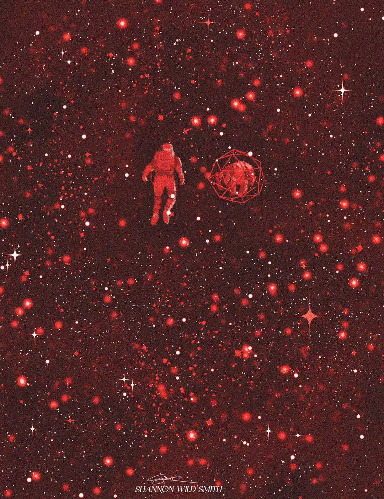

# Project Hail Mary — Physics Simulation Engine



---

## The Book That Kept Me Up at Night

I first read *Project Hail Mary* by Andy Weir five years ago. I finished it in three nights — not because I planned to, but because I physically could not put it down. Ryland Grace waking up alone on a ship with no memory of who he is, slowly piecing together that he is the last hope for all of human civilization, is one of the best openings in science fiction. And then Rocky shows up. If you know, you know.

What hooked me wasn't just the story — it was the *physics*. Andy Weir does something rare: he treats his reader as an intelligent adult. The brachistochrone trajectory. Special relativity and time dilation. The terrifying fuel mass calculation that makes every conventional propulsion system a cosmic joke. The sheer audacity of Astrophage — a microorganism that consumes starlight and stores energy at densities that dwarf anything we've ever built — making an interstellar voyage not just theoretically possible but *compact*.

When the movie came out, I was excited and then quietly disappointed. The things I loved most — the physics monologues, the engineering problem-solving, the raw numbers that make the Astrophage miracle legible — were exactly the things that got cut. The story survived. The science didn't.

So I decided to build the science.

---

## What This Is

**PHM Engine** is a GPU-accelerated simulation of the *Hail Mary*'s journey from Earth to Tau Ceti, written in C++20 with Metal compute shaders and a WebGPU browser port.

It is not a game. It is not a movie tie-in. It is an attempt to render the physics of the book correctly and interactively — to make visible the things the film left on the cutting room floor.

### What the simulation models

**Relativistic trajectory**
The ship travels on a brachistochrone arc — constant 1g acceleration to the midpoint, flip, constant 1g deceleration to Tau Ceti. At peak velocity, clocks on the ship run at a different rate than clocks on Earth. The simulation shows both timelines in real time.

**The fuel problem**
The energy comparison panel shows, on a logarithmic scale, why every conventional fuel source is impossible. Chemical propulsion? The required fuel mass exceeds the observable universe. Fusion? Still impossible by many orders of magnitude. Astrophage? 820 kg. That number is the entire premise of the book, and it deserves to be seen.

**Astrophage particle dynamics**
2 million Astrophage particles are simulated on the GPU — absorbing photons, storing energy, reproducing above threshold, dying below it. The fuel tank depletes visibly as the ship burns. This is the Metal compute layer: thread-per-particle kernels, spatial hashing for neighbor search, threadgroup shared memory for photon accumulation.

**Orbital mechanics**
The solar system is not a backdrop. All 8 planets are in their correct Kepler positions. The N-body integrator uses 4th-order Runge-Kutta. When the ship departs Earth, Earth is where Earth actually is.

**Interactive mission control dashboard**
Velocity as a fraction of c. Lorentz factor. Ship time vs. Earth time. Distance covered. Fuel remaining. Sliders for ship mass, acceleration, and destination. Everything live-updating.

---

## Build

```bash
# Clone and configure (no vcpkg install needed — deps via CMake FetchContent)
cmake -B build -G Ninja -DPHM_BUILD_METAL=OFF
cmake --build build

# Run tests
./build/bin/phm_tests

# Metal compute (macOS only — requires metal-cpp)
bash scripts/fetch_metal_cpp.sh
cmake -B build -G Ninja -DPHM_BUILD_METAL=ON
cmake --build build
```

---

## Phases

| Phase | Status | Deliverable |
|---|---|---|
| 0 — Scaffold | ✅ Done | Build system, CI, 23/23 tests green |
| 1 — Physics Engine | 🔧 In progress | Validated brachistochrone + relativity CLI |
| 2 — Memory Architecture | Planned | Custom allocators, SoA ECS, benchmarks |
| 3 — Metal Render Pipeline | Planned | Two star systems in 3D, ship arc, camera |
| 4 — Metal Compute: Astrophage | Planned | 2M particles at 60fps on Apple Silicon |
| 5 — Interactive Dashboard | Planned | Full ImGui mission control UI |
| 6 — WebGPU Browser Port | Planned | Runs in Chrome, zero install |

---

## Tech Stack

- **C++20** — coroutines, concepts, `std::jthread`, structured bindings throughout
- **Metal / metal-cpp** — compute kernels and render pipeline on macOS
- **WebGPU / Dawn** — WGSL port of the same kernels for browser deployment
- **Eigen** — linear algebra for physics and orbital mechanics
- **Dear ImGui** — dashboard and mission control UI
- **tinygltf** — glTF 2.0 model loading for PBR planet/ship assets
- **CMake FetchContent** — all deps fetched at configure time, no package manager needed
- **Google Benchmark** — every module ships with measured throughput numbers

---

## The Point

The book ends with a choice that only makes sense if you understand what the Astrophage actually is and what it costs to be out there. The physics is not decoration — it is the emotional weight of the story. This project exists to make that weight tangible.

> *"amaze amaze amaze."*

---

*Built by a reader who needed to see the numbers.*
